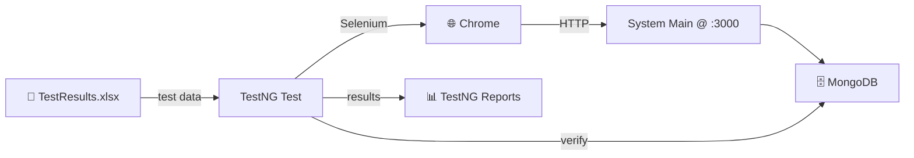

# 🧪 Automated Tests — Selenium + TestNG Suite

End-to-end UI automation for the Student Management System. These tests drive a real Chrome browser against the running web app, feed data from Excel, and verify persisted records directly in MongoDB.

> 📚 For the full project overview, see the [root README](../README.md).

---

## 🧰 Tech Stack

- **Java** `17`
- **Selenium WebDriver** `4.7.0`
- **TestNG** `7.11.0`
- **Apache POI** `5.2.3` — Excel-driven test data
- **MongoDB Java Driver** `4.8.2` — database assertions
- **Maven** (`pom.xml`) — build & dependency management
- **Ant** (`build.xml`) — styled XSLT HTML reports
- **SLF4J** + **Log4j2** — logging

---

## 📁 Structure

```
Automated Tests/
├── pom.xml                     # Maven build & dependencies
├── build.xml                   # Ant task: generateReport (XSLT)
├── testng.xml                  # Suite, groups & test classes
├── testng-results.xsl          # XSLT stylesheet for reports
├── src/
│   ├── main/java/utils/
│   │   ├── ExcelUtils.java     # Read/write TestResults.xlsx
│   │   └── MongoDBUtils.java   # studentExists / courseExists checks
│   └── test/java/tests/        # All TestNG test classes
│       ├── BaseTest.java       # Chrome setup + navigate to app
│       ├── HomePageTest.java
│       ├── LoginTest.java
│       ├── RegisterTest.java
│       ├── StudentLoginTest.java
│       ├── Admin*Test.java     # Admin CRUD & marks flows
│       └── Student*Test.java   # Student dashboard flows
├── test-output/                # TestNG generated reports
└── testng-xslt/                # Styled HTML reports
```

---

## ✅ Prerequisites

| Requirement | Notes |
|-------------|-------|
| **Java JDK 17** | Matches `maven.compiler.release` |
| **Maven 3.8+** | Runs the suite |
| **Google Chrome** | Target browser |
| **ChromeDriver** | Version must match your Chrome |
| **MongoDB** | Running at `mongodb://localhost:27017` |
| **The web app** | Must be running at `http://127.0.0.1:3000/` |

---

## ⚙️ Configuration (Update Before Running)

Some paths are **hard-coded** and must be updated for your machine:

| Setting | File | Current Value |
|---------|------|---------------|
| ChromeDriver path | `src/test/java/tests/BaseTest.java` | `C:\selenium webdriver\ChromeDriver\chromedriver-win64\chromedriver.exe` |
| App base URL | `src/test/java/tests/BaseTest.java` | `http://127.0.0.1:3000/` |
| Excel data file | Test classes (e.g. `LoginTest.java`) | `TestResults.xlsx` (absolute path) |
| MongoDB connection | `src/main/java/utils/MongoDBUtils.java` | `mongodb://localhost:27017`, DB `studentDB` |

---

## 🚀 Running the Tests

1. Start **MongoDB**.
2. Start the **web app** (see [`../System Main/README.md`](../System%20Main/README.md)).
3. From this folder, run:

```bash
mvn clean test
```

Maven picks up `testng.xml` and executes the full suite.

---

## 🧩 Test Suite & Groups

Defined in [`testng.xml`](./testng.xml), tests are organized into three groups:

### 🔑 `login`
- `HomePageTest` — landing page
- `LoginTest` — admin login (data-driven from Excel)
- `RegisterTest` — account registration
- `StudentLoginTest` — student login

### 🎓 `student`
- `StudentMainPageTest` — student dashboard
- `StudentCourseMainTest` — assigned courses view
- `StudentMarksMainTest` — marks view

### 👨‍💼 `admin`
- `AdminMainPageTest` — admin dashboard
- `AdminAddStudentTest`, `AdminListStudentTest`, `AdminSearchStudentTest`
- `AdminAddCourseTest`, `AdminAssignCourseTest`, `AdminSearchCourseTest`
- `AdminMarksMainTest`, `AdminEnterMarksTest`, `AdminUpdateMarksTest`

> ℹ️ `BaseTest` handles Chrome setup and teardown; other files such as `FullTest`, `AdminStudentsTest`, `UpdateStudentTest`, and `DeleteStudentTest` are supporting/experimental classes not wired into the main suite.

---

## 🛠 How It Works



1. **ExcelUtils** loads test inputs and writes pass/fail results back.
2. **Selenium** performs UI actions (login, add student, enter marks, …).
3. **MongoDBUtils** confirms the data was persisted correctly.
4. **TestNG** aggregates results into reports.

---

## 📊 Reports

After a run:

- **TestNG default:** `test-output/index.html`
- **Emailable:** `test-output/emailable-report.html`
- **Styled XSLT:** `testng-xslt/index.html`

Regenerate the styled report with Ant:

```bash
ant generateReport
```

This transforms `test-output/testng-results.xml` using `testng-results.xsl` into `testng-xslt/`.

---

## 🩺 Troubleshooting

| Symptom | Likely Cause / Fix |
|---------|--------------------|
| `SessionNotCreatedException` | ChromeDriver / Chrome version mismatch — update ChromeDriver |
| Browser opens but pages fail | Web app not running at `http://127.0.0.1:3000/` |
| `FileNotFoundException` for `.xlsx` | Update the Excel path in the test class |
| DB assertions fail | MongoDB not running, or `studentDB` is empty |
| Tests can't find elements | App UI changed — update the locators in the affected test |
