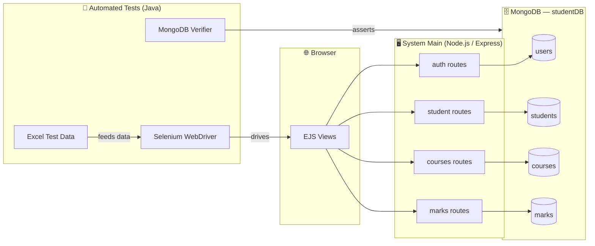

# 🎓 Student Management System (SMS)

A full-stack **Student Management System** that lets an institution manage students, courses, and marks through a clean web interface — paired with a complete **automated regression test suite** built with Selenium, TestNG, and Maven.

The repository is split into two independent but complementary parts:

| Part | Folder | Stack | Purpose |
|------|--------|-------|---------|
| 🌐 **Web Application** | [`System Main/`](./System%20Main) | Node.js · Express · MongoDB · EJS | The actual student management web app |
| 🧪 **Test Automation** | [`Automated Tests/`](./Automated%20Tests) | Java 17 · Selenium · TestNG · Maven | End-to-end UI + data validation tests for the web app |

---

## 📑 Table of Contents

- [Overview](#-overview)
- [Features](#-features)
- [Tech Stack](#-tech-stack)
- [Architecture](#-architecture)
- [Repository Structure](#-repository-structure)
- [Data Models](#-data-models)
- [Prerequisites](#-prerequisites)
- [Getting Started](#-getting-started)
- [Usage & User Roles](#-usage--user-roles)
- [Running the Automated Tests](#-running-the-automated-tests)
- [Test Reports](#-test-reports)
- [Configuration](#-configuration)
- [Security Notes](#-security-notes)
- [Roadmap](#-roadmap)
- [Contributing](#-contributing)
- [License](#-license)
- [Acknowledgements](#-acknowledgements)

---

## 🔎 Overview

The Student Management System provides two distinct experiences behind a single landing page:

- **Administrators** register/login with an email and password and get full control over students, courses, and marks.
- **Students** log in with their Student ID to view the courses assigned to them and their marks.

The companion **Automated Tests** module drives a real Chrome browser against the running application, feeds test data from an Excel workbook, and cross-checks results directly against the MongoDB database — producing rich TestNG and XSLT-styled HTML reports.

---

## ✨ Features

### 👨‍💼 Administrator
- 🔐 Secure registration & login (passwords hashed with **bcrypt**)
- 👥 **Students** — add, edit, delete, search, and list students
- 📚 **Courses** — add, edit, delete, search courses and **assign** them to students
- 📝 **Marks** — enter, update, and view marks (MST, EST, Internal, Total) per student & course
- 📊 Consolidated marks dashboard sorted by Student ID

### 🎓 Student
- 🔑 Simple login using **Student ID**
- 📖 View **courses** assigned to them
- 📈 View their **marks** and credits per course

### 🧪 Quality Engineering
- ✅ Automated end-to-end UI tests for every major flow
- 📂 **Data-driven** testing via Excel (`Apache POI`)
- 🗄️ Direct **MongoDB assertions** to verify persisted data
- 🧩 Organized TestNG **groups** (`login`, `student`, `admin`)
- 📊 Custom HTML reports via TestNG XSLT

---

## 🛠 Tech Stack

### Web Application (`System Main`)
- **Runtime:** Node.js
- **Framework:** Express `4.21.2`
- **Database:** MongoDB via Mongoose `8.10.1`
- **Views:** EJS `3.1.10`
- **Auth & Sessions:** bcryptjs, express-session, connect-flash
- **Middleware:** body-parser

### Test Automation (`Automated Tests`)
- **Language:** Java `17`
- **Build:** Maven (`pom.xml`) + Ant (`build.xml` for report generation)
- **Browser Automation:** Selenium WebDriver `4.7.0`
- **Test Framework:** TestNG `7.11.0`
- **Excel Data:** Apache POI `5.2.3`
- **DB Verification:** MongoDB Java Driver `4.8.2`
- **Logging:** SLF4J + Log4j2

---

## 🏗 Architecture



**Request flow:** Browser → Express route → Mongoose model → MongoDB → EJS view rendered back to the browser.

---

## 📁 Repository Structure

```
Student-Management-System/
├── System Main/                # 🌐 Node.js/Express web application
│   ├── server.js               # App entry point (port 3000)
│   ├── package.json
│   ├── models/                 # Mongoose schemas
│   │   ├── User.js             # Admin accounts
│   │   ├── Student.js          # Student records
│   │   ├── Course.js           # Course catalog
│   │   └── Marks.js            # Marks per student/course
│   ├── routes/                 # Express route handlers
│   │   ├── auth.js             # Register / login / logout
│   │   ├── student.js          # Student CRUD & search
│   │   ├── courses.js          # Course CRUD & assignment
│   │   └── marks.js            # Enter / update / view marks
│   ├── views/                  # EJS templates (admin + student UI)
│   ├── public/                 # Static CSS & JS
│   └── images/                 # Logo & background assets
│
└── Automated Tests/            # 🧪 Java/Selenium/TestNG suite
    ├── pom.xml                 # Maven build & dependencies
    ├── build.xml               # Ant task for XSLT HTML reports
    ├── testng.xml              # Suite, groups & test classes
    ├── src/
    │   ├── main/java/utils/    # ExcelUtils, MongoDBUtils
    │   └── test/java/tests/    # All TestNG test classes
    ├── test-output/            # TestNG generated reports
    └── testng-xslt/            # Styled HTML reports
```

---

## 🗃 Data Models

| Model | Key Fields | Notes |
|-------|-----------|-------|
| **User** (admin) | `username`, `email` (unique), `password` (hashed), `dob` | Email format validated; created timestamp stored |
| **Student** | `studentID` (unique), `name`, `dob`, `branch`, `courses[]` | Login uses `studentID` |
| **Course** | `courseCode` (unique), `courseName`, `description`, `credits`, `assignedTo[]` | `assignedTo` holds student references |
| **Marks** | `studentID`, `courseCode`, `mst` (≤30), `est` (≤40), `internal` (≤30), `total` (≤100) | One record per student/course |

---

## ✅ Prerequisites

Make sure the following are installed:

| Tool | Recommended Version | Used By |
|------|--------------------|---------|
| [Node.js](https://nodejs.org/) & npm | LTS (16+) | Web app |
| [MongoDB](https://www.mongodb.com/try/download/community) | 5.0+ | Web app & tests |
| [Java JDK](https://adoptium.net/) | 17 | Automated tests |
| [Apache Maven](https://maven.apache.org/) | 3.8+ | Automated tests |
| [Google Chrome](https://www.google.com/chrome/) + [ChromeDriver](https://chromedriver.chromium.org/) | Matching versions | Automated tests |

---

## 🚀 Getting Started

### 1️⃣ Clone the repository

```bash
git clone <your-repo-url>
cd Student-Management-System
```

### 2️⃣ Start MongoDB

Ensure a local MongoDB instance is running at `mongodb://localhost:27017`. The app automatically uses the `studentDB` database.

### 3️⃣ Run the web application

```bash
cd "System Main"
npm install
node server.js
```

The app will be available at **http://localhost:3000**.

> 💡 For detailed web-app instructions, see [`System Main/README.md`](./System%20Main/README.md).

### 4️⃣ Run the automated tests (optional)

With the web app **running**, in a separate terminal:

```bash
cd "Automated Tests"
mvn clean test
```

> 💡 For detailed testing instructions, see [`Automated Tests/README.md`](./Automated%20Tests/README.md).

---

## 👤 Usage & User Roles

From the landing page (`/`) you can choose **Login** or **Register**.

### Administrator
1. **Register** an account (username, email, password, DOB).
   - Password must be **at least 8 alphanumeric characters and include a number**.
2. **Login** with your email and password → redirected to the **Admin dashboard**.
3. Manage students, courses, and marks.

### Student
1. Go to the student login page (`/login_norm`).
2. Login with your **Student ID** → redirected to the **Student dashboard**.
3. View assigned courses and marks.

---

## 🧪 Running the Automated Tests

The suite is orchestrated by [`testng.xml`](./Automated%20Tests/testng.xml) and grouped into:

- **`login`** — Home page, admin login, registration, student login
- **`student`** — Student dashboard, courses, and marks pages
- **`admin`** — Student CRUD, course CRUD & assignment, marks entry & update

Run everything with:

```bash
cd "Automated Tests"
mvn clean test
```

> ⚠️ The web application **and** MongoDB must be running before starting the tests, since the tests drive the live UI at `http://127.0.0.1:3000/` and verify data in MongoDB.

---

## 📊 Test Reports

After a test run, reports are generated automatically:

- **TestNG default reports:** `Automated Tests/test-output/index.html`
- **Emailable report:** `Automated Tests/test-output/emailable-report.html`
- **Styled XSLT report:** `Automated Tests/testng-xslt/index.html`

To regenerate the styled XSLT report via Ant:

```bash
cd "Automated Tests"
ant generateReport
```

---

## ⚙️ Configuration

| Setting | Location | Default |
|---------|----------|---------|
| App port | `System Main/server.js` | `3000` |
| MongoDB URI | `System Main/server.js` | `mongodb://localhost:27017/studentDB` |
| Base URL (tests) | `Automated Tests/.../BaseTest.java` | `http://127.0.0.1:3000/` |
| ChromeDriver path | `Automated Tests/.../BaseTest.java` | Update to your local path |
| Excel test data | Test classes (`TestResults.xlsx`) | Update to your local path |

> 🔧 The tests currently reference **absolute local paths** for ChromeDriver and the Excel data file. Update these to match your machine before running.

---

## 🔒 Security Notes

This project is intended for **educational / academic use**. Before any production deployment, consider hardening:

- Move the hard-coded **session secret** and **MongoDB URI** into environment variables (e.g. `dotenv`).
- Replace the simplified **student login** with a proper hashed-password mechanism.
- Add CSRF protection, rate limiting, and stricter input validation.
- Enforce role-based access control on all admin routes.

---

## 🗺 Roadmap

- [ ] Externalize configuration via environment variables
- [ ] Add role-based middleware for all protected routes
- [ ] Introduce a REST/JSON API layer
- [ ] Add CI pipeline to run the Selenium suite automatically
- [ ] Containerize the app and database with Docker
- [ ] Add unit tests for route/controller logic

---

## 🤝 Contributing

Contributions are welcome!

1. Fork the repository
2. Create a feature branch: `git checkout -b feature/my-feature`
3. Commit your changes: `git commit -m "Add my feature"`
4. Push the branch: `git push origin feature/my-feature`
5. Open a Pull Request

Please keep the web app and test suite in sync — new UI flows should come with matching automated tests.

---

## 📄 License

No formal `LICENSE` file is included. The Node package manifest declares the **ISC** license. Add a license file if you intend to distribute this project.

---

## 🙏 Acknowledgements

- Built as a full-stack + test-automation learning project.
- UI branding uses the Thapar Institute logo (academic context).
- Powered by open-source projects: Express, Mongoose, EJS, Selenium, TestNG, Apache POI, and the MongoDB Java Driver.
